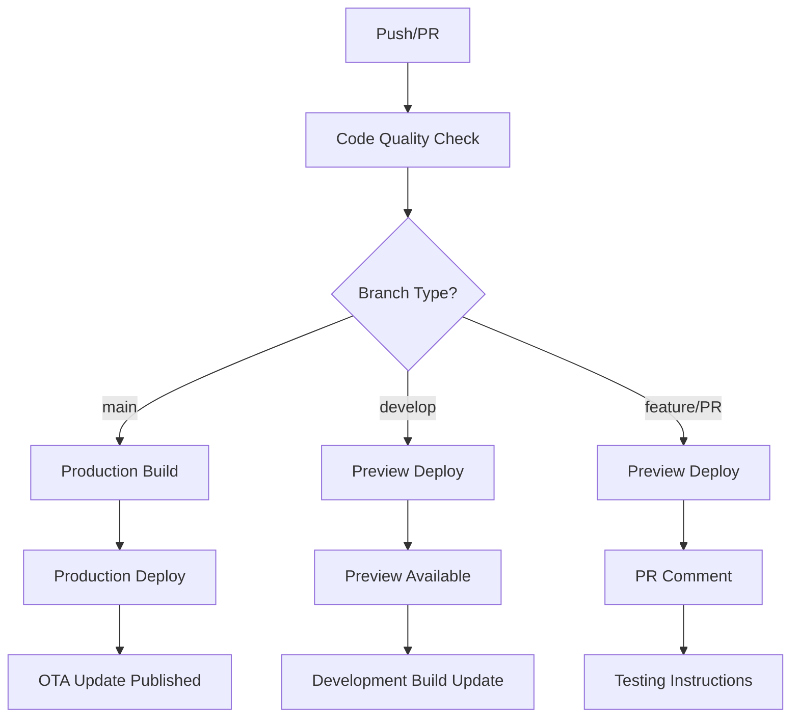
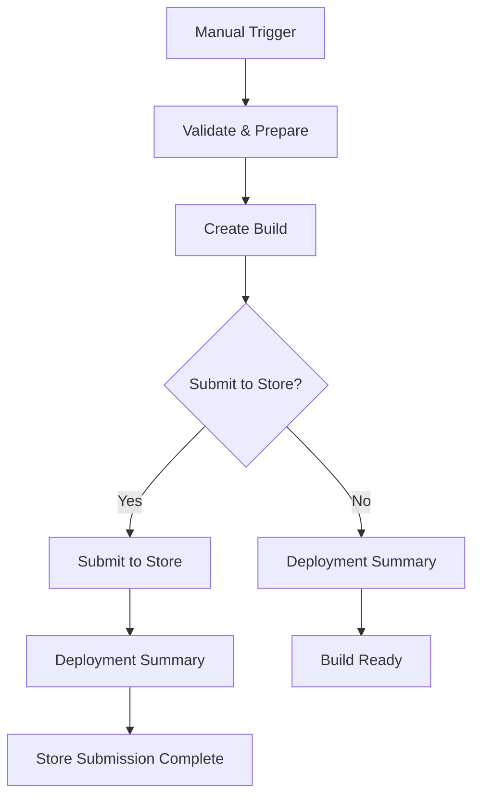

# Versioning & Download Links Guide

This guide explains how versioning works in the CI/CD pipeline and how download links are generated for different branch types.

## 🏷️ Version Naming Strategy

### Production Builds (main branch)
- **Format**: `{version}` (e.g., `1.0.0`)
- **Source**: Uses version from `app.json` file
- **Example**: `1.0.0`

### Preview Builds (develop branch)
- **Format**: `{version}-{profile-type}-{timestamp}`
- **Source**: app.json version + profile type + timestamp
- **Example**: `1.0.0-staging-20241201-143022`

### Development Builds (feature branches)
- **Format**: `{version}-{profile-type}-{timestamp}-{commit-hash}`
- **Source**: app.json version + profile type + timestamp + short commit hash
- **Example**: `1.0.0-dev-20241201-143022-a1b2c3d`

### Pull Request Builds
- **Format**: `{version}-preview-{timestamp}-{commit-hash}`
- **Source**: app.json version + "preview" + timestamp + commit hash
- **Example**: `1.0.0-preview-20241201-143022-a1b2c3d`

## 🌿 Branch-Based Behavior

### Main Branch (`main`)
**Workflow**: `Code Quality Check → Production Build → Production Deploy`

**Behavior**:
- Runs full production build process
- Uses clean version number (e.g., `1.0.0`)
- Publishes to `production` branch on EAS Update
- Only builds if no existing production build exists
- Publishes OTA update for existing users

**Download Links**:
- 📱 **APK**: `https://expo.dev/artifacts/eas/...`
- 🔗 **Build Info**: `https://expo.dev/accounts/[username]/projects/[project]/builds/[build-id]`

### Develop Branch (`develop`)
**Workflow**: `Code Quality Check → Preview Deploy`

**Behavior**:
- Skips production build
- Uses staging version format (e.g., `1.0.0-staging-20241201-143022`)
- Publishes to `preview-develop` branch on EAS Update
- Immediate preview deployment

**Download Links**:
- 📱 **Preview Update**: Available in development builds
- 🔗 **Dashboard**: `https://expo.dev/accounts/[username]/projects/[project]/updates`

### Feature Branches
**Workflow**: `Code Quality Check → Preview Deploy`

**Behavior**:
- No builds, only preview updates
- Uses development version format (e.g., `1.0.0-dev-20241201-143022-a1b2c3d`)
- Publishes to `preview-[branch-name]` branch on EAS Update
- Quick testing and validation

**Download Links**:
- 📱 **Preview Update**: Available in development builds
- 🔗 **Branch-specific**: `preview-[clean-branch-name]`

### Pull Requests
**Workflow**: `Code Quality Check → Preview Deploy → PR Comment`

**Behavior**:
- Same as feature branches
- Automatically comments on PR with preview links
- Easy testing for code reviews
- Clean branch naming (special characters replaced with `-`)

**Download Links**:
- 📱 **Preview Update**: Available in development builds
- 🔗 **PR Comment**: Includes dashboard link and instructions
- 🔗 **QR Code**: Available on Expo dashboard

## 📱 Download Link Generation

### Production Builds
```bash
# Build creates these outputs:
BUILD_ID="550e8400-e29b-41d4-a716-446655440000"
BUILD_URL="https://expo.dev/accounts/[username]/projects/[project]/builds/[build-id]"
DOWNLOAD_URL="https://expo.dev/artifacts/eas/[build-id]/[filename].apk"
```

### Development Builds
```bash
# For development profile:
PROJECT_ID="20fa8d70-adf2-4ad6-8532-0f6c4e56ee03"
QR_URL="https://qr.expo.dev/development-build?url=exp://PROJECT_ID"
```

### Preview Updates
```bash
# For preview updates:
PREVIEW_URL="https://expo.dev/accounts/[username]/projects/[project]/updates"
QR_URL="https://qr.expo.dev/eas-update?updateId=preview-[branch]&appScheme=exp"
```

## 🎯 CI/CD Pipeline Flow

### Automatic Workflow (Push/PR)


### Manual Workflow (Dispatch)


## 🔍 Version Detection Logic

### In CI/CD Pipeline
```yaml
# Get current version from app.json
CURRENT_VERSION=$(cat app.json | jq -r '.expo.version // "1.0.0"')

# Generate build version based on branch type
if [[ "$branch_type" == "production" ]]; then
  BUILD_VERSION="$CURRENT_VERSION"
else
  TIMESTAMP=$(date +%Y%m%d-%H%M%S)
  SHORT_SHA=${GITHUB_SHA:0:7}
  BUILD_VERSION="$CURRENT_VERSION-$branch_type-$TIMESTAMP-$SHORT_SHA"
fi
```

### In Manual Workflow
```yaml
# Priority order:
1. Custom version input (if provided)
2. Profile-based version generation
3. Fallback to app.json version
```

## 📊 Build Artifacts & Links

### Production Build Artifacts
- **APK File**: Direct download link
- **Build Logs**: Detailed build process
- **Metadata**: Build information and dependencies
- **Store Submission**: Automatic submission (if enabled)

### Preview Update Artifacts
- **Update Bundle**: JavaScript bundle for OTA
- **Assets**: Images, fonts, and other resources
- **Branch Info**: EAS Update branch details
- **QR Code**: For easy mobile testing

## 🛠️ Manual Build Options

### Development Profile
```bash
# Example version: 1.0.0-dev-20241201-143022-a1b2c3d
Platform: android
Profile: development
Submit: false
QR Code: Available for testing
```

### Preview Profile
```bash
# Example version: 1.0.0-beta-20241201-143022
Platform: android
Profile: preview  
Submit: optional
Internal testing: Enabled
```

### Production Profile
```bash
# Example version: 1.0.0
Platform: android
Profile: production
Submit: optional
Store ready: Yes
```

## 🔗 Where to Find Download Links

### 1. GitHub Actions Logs
- Go to Actions tab in your repository
- Click on the workflow run
- Check the "Deployment Summary" step
- Find download links in the logs

### 2. Expo Dashboard
- Visit [expo.dev/accounts/[username]/projects/[project]](https://expo.dev/accounts/[username]/projects/[project])
- Navigate to "Builds" tab for APK downloads
- Navigate to "Updates" tab for OTA updates

### 3. PR Comments (for Pull Requests)
- Check the PR comments
- Look for the CI/CD bot comment
- Find preview links and testing instructions

### 4. Build Notifications
- Check your email for build completion notifications
- EAS sends notifications with download links
- GitHub sends workflow completion notifications

## 📋 Version Management Best Practices

### Production Releases
1. **Semantic Versioning**: Use semantic versioning (e.g., `1.0.0`, `1.1.0`, `2.0.0`)
2. **Manual Version Updates**: Update version in `app.json` before releasing
3. **Tag Releases**: Create git tags for production versions
4. **Changelog**: Maintain a changelog for production releases

### Development Workflow
1. **Automatic Versioning**: Let CI/CD handle non-production versions
2. **Branch Naming**: Use descriptive branch names (e.g., `feature/user-auth`)
3. **Preview Testing**: Test preview updates before merging
4. **Clean Merges**: Ensure clean merges to main branch

## 🔍 Troubleshooting Download Links

### Common Issues:

1. **"Download link not available"**
   - Build may still be in progress
   - Check build logs for errors
   - Verify build completed successfully

2. **"QR code not working"**
   - Ensure you have a development build installed
   - Check that the project ID is correct
   - Verify the update branch exists

3. **"APK not downloading"**
   - Check if build artifacts are ready
   - Verify you have permission to access the build
   - Try refreshing the Expo dashboard

4. **"Preview update not showing"**
   - Check the EAS Update branch name
   - Verify the update was published successfully
   - Ensure your development build is on the correct branch

---

**Need Help?**
- Check the [EAS Documentation](https://docs.expo.dev/eas/)
- Review build logs in GitHub Actions
- Visit the Expo Dashboard for detailed build information 